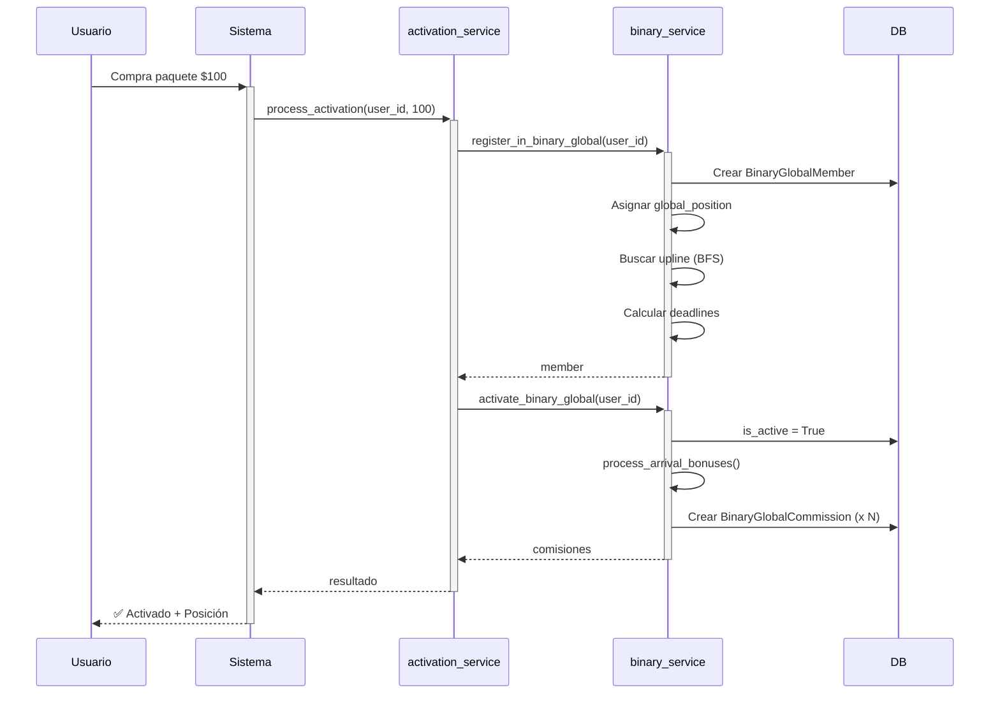
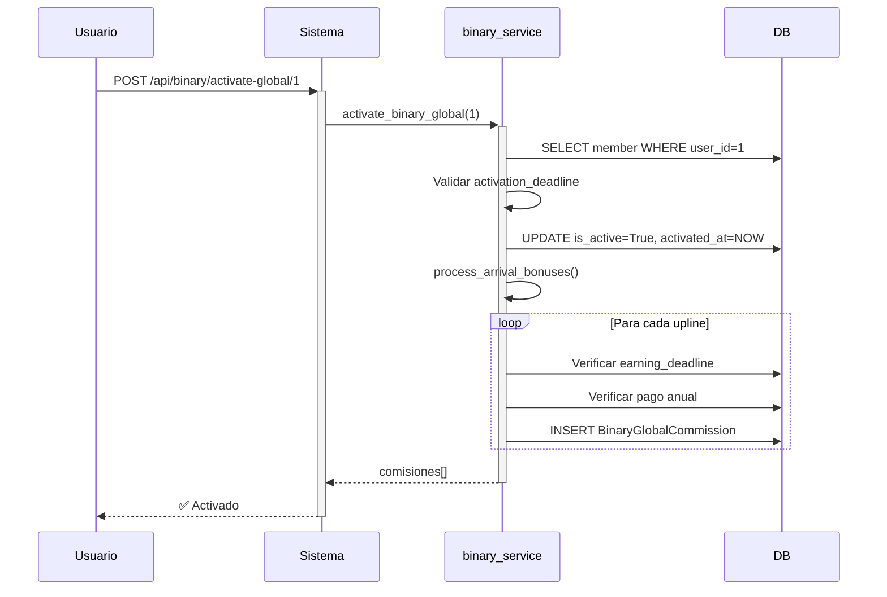

# 🌐 BINARY GLOBAL 2x2 - DOCUMENTACIÓN TÉCNICA COMPLETA

**Sistema de Red Binaria Global con Pre-afiliación y Ventana de Ganancias**

---

## 📑 ÍNDICE

1. [Visión General](#visión-general)
2. [Concepto del Negocio](#concepto-del-negocio)
3. [Arquitectura Técnica](#arquitectura-técnica)
4. [Reglas de Negocio](#reglas-de-negocio)
5. [Flujo de Usuario](#flujo-de-usuario)
6. [API Endpoints](#api-endpoints)
7. [Base de Datos](#base-de-datos)
8. [Cálculo de Comisiones](#cálculo-de-comisiones)
9. [Casos de Uso](#casos-de-uso)
10. [Troubleshooting](#troubleshooting)

---

## 🎯 VISIÓN GENERAL

### ¿Qué es Binary Global 2x2?

**Binary Global 2x2** es un plan de compensación multinivel revolucionario que combina:

- ✅ **Pre-afiliación gratuita** (120 días para activar)
- ✅ **Posicionamiento global BFS** (orden de llegada mundial)
- ✅ **Estructura binaria 2x2** (cada nodo tiene máximo 2 hijos)
- ✅ **Ventana de ganancias** (367 días desde registro)
- ✅ **Comisiones en niveles impares** (3, 5, 7, 9, 11, 13, 15, 17, 19, 21)
- ✅ **Pago anual por miembro** (máximo 1 pago/año por miembro activo)

### Ventajas Competitivas

1. **Pre-registro Gratuito**: Asegura tu posición sin inversión inicial
2. **Sin Límite de Pierna**: Cobras por ambas líneas (izquierda y derecha)
3. **Derrame Global**: Recibes usuarios que no conoces por orden de llegada
4. **Niveles Profundos**: Hasta nivel 21 (2,097,152 posibles miembros)
5. **Ventana de 367 Días**: Un año completo para generar ingresos

---

## 💼 CONCEPTO DEL NEGOCIO

### Fases del Miembro

```
┌─────────────────┐
│  NO REGISTRADO  │
└────────┬────────┘
         │ Compra paquete o pre-registro
         ▼
┌─────────────────┐
│ PRE-REGISTRADO  │ ◄── 120 días para activar
│ (is_active=0)   │     Ventana de ganancias: 367 días
└────────┬────────┘
         │ Confirma pago
         ▼
┌─────────────────┐
│     ACTIVO      │ ◄── Genera comisiones a uplines
│ (is_active=1)   │     Puede ganar por 367 días
└─────────────────┘
```

### Timeline Crítico

| Evento | Días desde Registro | Campo DB |
|--------|---------------------|----------|
| Pre-registro | Día 0 | `registered_at` |
| Límite activación | Día 120 | `activation_deadline` |
| Límite ganancias | Día 367 | `earning_deadline` |
| Activación | Variable | `activated_at` |

### Estructura de Árbol 2x2

```
                    Nivel 1 (Tú)
                        │
        ┌───────────────┴───────────────┐
        │                               │
    Nivel 2                         Nivel 2
      │                               │
  ┌───┴───┐                       ┌───┴───┐
  │       │                       │       │
Niv 3   Niv 3                   Niv 3   Niv 3
```

**Cálculo de posiciones por nivel:**
- Nivel 1: 2^0 = 1 persona (tú)
- Nivel 2: 2^1 = 2 personas
- Nivel 3: 2^2 = 4 personas
- Nivel 4: 2^3 = 8 personas
- ...
- Nivel 21: 2^20 = 1,048,576 personas

---

## 🏗️ ARQUITECTURA TÉCNICA

### Stack Tecnológico

**Backend:**
- FastAPI (Python 3.14)
- SQLAlchemy ORM
- SQLite (dev) / PostgreSQL (prod)
- Pydantic para validación

**Frontend:**
- React 18.3.1
- Vite 6.0.5
- Axios para HTTP
- React Router

### Estructura de Archivos

```
backend/
├── database/
│   └── models/
│       └── binary_global.py          # Modelos SQLAlchemy
├── mlm/
│   ├── services/
│   │   └── binary_service.py         # Lógica de negocio
│   └── plans/
│       └── binario_global/
│           └── plan_template.yml     # Configuración de comisiones
└── routers/
    └── binary.py                     # Endpoints API

frontend/
└── src/
    └── pages/
        └── dashboard/
            └── BinaryGlobalView.jsx  # Vista de usuario
```

### Modelos de Datos

#### BinaryGlobalMember

```python
class BinaryGlobalMember(Base):
    __tablename__ = "binary_global_members"
    
    id = Column(Integer, primary_key=True)
    user_id = Column(Integer, nullable=False, index=True)
    upline_id = Column(Integer, ForeignKey("binary_global_members.id"))
    position = Column(String(10))  # 'left' | 'right'
    global_position = Column(Integer, unique=True)
    is_active = Column(Boolean, default=False)
    registered_at = Column(DateTime, default=datetime.utcnow)
    activation_deadline = Column(DateTime)  # +120 days
    earning_deadline = Column(DateTime)     # +367 days
    activated_at = Column(DateTime)
```

#### BinaryGlobalCommission

```python
class BinaryGlobalCommission(Base):
    __tablename__ = "binary_global_commissions"
    
    id = Column(Integer, primary_key=True)
    user_id = Column(Integer, nullable=False)
    member_id = Column(Integer, ForeignKey("binary_global_members.id"))
    level = Column(Integer, nullable=False)
    commission_amount = Column(Float, nullable=False)
    paid_at = Column(DateTime, default=datetime.utcnow)
    year = Column(Integer, nullable=False)
    
    __table_args__ = (
        UniqueConstraint('user_id', 'member_id', 'level', 'year'),
    )
```

---

## 📋 REGLAS DE NEGOCIO

### 1. Pre-Registro

**Trigger:** Usuario compra primer paquete o se registra manualmente

**Acciones:**
```python
1. Crear registro en binary_global_members
2. Asignar global_position (auto-incremental)
3. Calcular activation_deadline = registered_at + 120 días
4. Calcular earning_deadline = registered_at + 367 días
5. Buscar upline (BFS: primer nodo con espacio)
6. Asignar position ('left' o 'right')
7. is_active = False
```

**Validaciones:**
- ✅ Usuario no debe existir ya en binary_global_members
- ✅ global_position debe ser único
- ✅ upline_id debe existir (o NULL si es el primero)

### 2. Activación

**Trigger:** Usuario confirma pago del paquete

**Acciones:**
```python
1. Cambiar is_active = True
2. Registrar activated_at = ahora
3. Ejecutar process_arrival_bonuses(db, member)
4. Distribuir comisiones a uplines elegibles
```

**Validaciones:**
- ✅ Member debe existir
- ✅ is_active debe ser False
- ✅ activated_at debe ser NULL
- ✅ Debe estar dentro de activation_deadline

### 3. Comisiones de Llegada

**Trigger:** Nuevo miembro se activa

**Algoritmo:**
```python
def process_arrival_bonuses(db, new_member):
    rules = get_arrival_bonus_rules()  # Lee YAML
    
    ancestor = new_member.upline
    level = 2  # Empezamos en nivel 2
    
    while ancestor:
        level += 1
        
        # Solo niveles impares desde 3
        if level >= 3 and level <= 21 and level % 2 == 1:
            
            # Validar ventana de ganancias
            if ancestor.earning_deadline > now():
                
                # Verificar si ya pagó este año
                year = now().year
                existing = query(BinaryGlobalCommission).filter(
                    user_id=ancestor.user_id,
                    member_id=new_member.id,
                    level=level,
                    year=year
                ).first()
                
                if not existing:
                    amount = rules[level]  # $0.50 o $1.00
                    create_commission(ancestor, new_member, level, amount)
        
        ancestor = ancestor.upline
```

### 4. Configuración de Comisiones (YAML)

**Archivo:** `backend/mlm/plans/binario_global/plan_template.yml`

```yaml
plan:
  name: "Binary Global 2x2"
  version: "1.0"
  
arrival_bonus:
  # Niveles impares 3-13: $0.50
  - levels: [3, 5, 7, 9, 11, 13]
    amount: "0.50"
  
  # Niveles impares 15-21: $1.00
  - levels: [15, 17, 19, 21]
    amount: "1.00"

rules:
  pre_affiliation_days: 120
  earning_window_days: 367
  max_payments_per_year: 1
  placement_strategy: "BFS"  # Breadth-First Search
```

### 5. Expiración y Limpieza

**CRON Job Diario:**
```python
def check_expirations(db):
    now = datetime.utcnow()
    
    # Buscar pre-registrados expirados
    expired = query(BinaryGlobalMember).filter(
        is_active == False,
        activation_deadline < now
    ).all()
    
    for member in expired:
        # 1. Obtener hijos
        children = query(BinaryGlobalMember).filter(
            upline_id == member.id
        ).all()
        
        # 2. Reasignar hijos al upline del miembro eliminado
        for child in children:
            child.upline_id = member.upline_id
            # Mantener position o recalcular según lógica
        
        # 3. Eliminar miembro
        db.delete(member)
    
    db.commit()
```

---

## 🔄 FLUJO DE USUARIO

### Caso 1: Nuevo Usuario que Compra Paquete



### Caso 2: Usuario Pre-registrado Activa



---

## 🔌 API ENDPOINTS

### 1. Obtener Estado

**GET** `/api/binary/global/{user_id}`

**Response (No Registrado):**
```json
{
  "status": "not_registered"
}
```

**Response (Pre-Registrado):**
```json
{
  "status": "pre_registered",
  "global_position": 42,
  "activation_deadline": "2025-04-05T10:30:00",
  "earning_deadline": "2026-12-06T10:30:00",
  "activated_at": null,
  "registered_at": "2024-12-06T10:30:00",
  "position": "left",
  "upline_id": 15,
  "is_active": false
}
```

**Response (Activo):**
```json
{
  "status": "active",
  "global_position": 42,
  "activation_deadline": "2025-04-05T10:30:00",
  "earning_deadline": "2026-12-06T10:30:00",
  "activated_at": "2024-12-15T14:20:00",
  "registered_at": "2024-12-06T10:30:00",
  "position": "right",
  "upline_id": 20,
  "is_active": true
}
```

### 2. Pre-Registrar Usuario

**POST** `/api/binary/pre-register/{user_id}`

**Request Body:** (vacío)

**Response:**
```json
{
  "message": "User pre-registered successfully",
  "global_position": 123,
  "activation_deadline": "2025-04-06T10:00:00"
}
```

### 3. Activar Usuario

**POST** `/api/binary/activate-global/{user_id}`

**Request Body:** (vacío)

**Response:**
```json
{
  "message": "User activated in Binary Global"
}
```

### 4. Ejecutar Limpieza de Expirados

**POST** `/api/binary/run-expirations`

**Response:**
```json
{
  "message": "Expiration check completed"
}
```

---

## 💾 BASE DE DATOS

### Esquema Completo

```sql
-- Tabla de miembros
CREATE TABLE binary_global_members (
    id INTEGER PRIMARY KEY AUTOINCREMENT,
    user_id INTEGER NOT NULL,
    upline_id INTEGER,
    position VARCHAR(10),
    global_position INTEGER UNIQUE,
    is_active BOOLEAN DEFAULT 0,
    registered_at TIMESTAMP DEFAULT CURRENT_TIMESTAMP,
    activation_deadline TIMESTAMP,
    earning_deadline TIMESTAMP,
    activated_at TIMESTAMP,
    FOREIGN KEY (upline_id) REFERENCES binary_global_members(id)
);

CREATE INDEX idx_bg_user ON binary_global_members(user_id);
CREATE INDEX idx_bg_global_pos ON binary_global_members(global_position);

-- Tabla de comisiones
CREATE TABLE binary_global_commissions (
    id INTEGER PRIMARY KEY AUTOINCREMENT,
    user_id INTEGER NOT NULL,
    member_id INTEGER NOT NULL,
    level INTEGER NOT NULL,
    commission_amount REAL NOT NULL,
    paid_at TIMESTAMP DEFAULT CURRENT_TIMESTAMP,
    year INTEGER NOT NULL,
    FOREIGN KEY (member_id) REFERENCES binary_global_members(id),
    UNIQUE(user_id, member_id, level, year)
);

CREATE INDEX idx_bgc_user ON binary_global_commissions(user_id);
CREATE INDEX idx_bgc_year ON binary_global_commissions(year);
```

### Queries Útiles

**Ver árbol de un usuario:**
```sql
WITH RECURSIVE tree AS (
  SELECT id, user_id, upline_id, position, global_position, 0 as depth
  FROM binary_global_members
  WHERE user_id = 1
  
  UNION ALL
  
  SELECT m.id, m.user_id, m.upline_id, m.position, m.global_position, t.depth + 1
  FROM binary_global_members m
  JOIN tree t ON m.upline_id = t.id
  WHERE t.depth < 21
)
SELECT * FROM tree ORDER BY depth, global_position;
```

**Comisiones de un año:**
```sql
SELECT 
  u.email,
  SUM(c.commission_amount) as total,
  COUNT(*) as payments
FROM binary_global_commissions c
JOIN users u ON c.user_id = u.id
WHERE c.year = 2025
GROUP BY c.user_id
ORDER BY total DESC;
```

**Usuarios por vencer:**
```sql
SELECT 
  user_id,
  global_position,
  activation_deadline,
  JULIANDAY(activation_deadline) - JULIANDAY('now') as days_left
FROM binary_global_members
WHERE is_active = 0
  AND activation_deadline > datetime('now')
ORDER BY days_left ASC;
```

---

## 💰 CÁLCULO DE COMISIONES

### Tabla de Comisiones

| Nivel | Paga | Monto | Posibles Personas |
|-------|------|-------|-------------------|
| 1 | ❌ No | $0.00 | 1 |
| 2 | ❌ No (par) | $0.00 | 2 |
| 3 | ✅ Sí | $0.50 | 4 |
| 4 | ❌ No (par) | $0.00 | 8 |
| 5 | ✅ Sí | $0.50 | 16 |
| 6 | ❌ No (par) | $0.00 | 32 |
| 7 | ✅ Sí | $0.50 | 64 |
| 8 | ❌ No (par) | $0.00 | 128 |
| 9 | ✅ Sí | $0.50 | 256 |
| 10 | ❌ No (par) | $0.00 | 512 |
| 11 | ✅ Sí | $0.50 | 1,024 |
| 12 | ❌ No (par) | $0.00 | 2,048 |
| 13 | ✅ Sí | $0.50 | 4,096 |
| 14 | ❌ No (par) | $0.00 | 8,192 |
| 15 | ✅ Sí | $1.00 | 16,384 |
| 16 | ❌ No (par) | $0.00 | 32,768 |
| 17 | ✅ Sí | $1.00 | 65,536 |
| 18 | ❌ No (par) | $0.00 | 131,072 |
| 19 | ✅ Sí | $1.00 | 262,144 |
| 20 | ❌ No (par) | $0.00 | 524,288 |
| 21 | ✅ Sí | $1.00 | 1,048,576 |

### Máximo Teórico Anual

**Si todos los niveles se llenan al 100%:**

```
Niveles 3-13 (6 niveles): (4+16+64+256+1024+4096) × $0.50 = $2,730
Niveles 15-21 (4 niveles): (16384+65536+262144+1048576) × $1.00 = $1,392,640
Total máximo anual = $1,395,370 USD
```

**Escenario Realista (5% llenado):**
```
5% de $1,395,370 = $69,768.50 USD/año
```

---

## 🎬 CASOS DE USO

### Caso 1: Usuario Nuevo Compra Paquete

**Entrada:**
- user_id: 50
- package_amount: 100

**Proceso:**
1. Sistema llama `register_in_binary_global(db, 50)`
2. Asigna global_position = 123 (siguiente disponible)
3. Busca upline con BFS → encuentra user 20 con slot "right" libre
4. Crea registro:
   - upline_id = 20
   - position = "right"
   - activation_deadline = now + 120 días
   - earning_deadline = now + 367 días
   - is_active = False

5. Usuario ve dashboard:
   - Status: "Pre-Registrado"
   - Timer: "120 días para activar"
   - Posición: #123

### Caso 2: Usuario Activa su Cuenta

**Entrada:**
- user_id: 50 (pre-registrado)

**Proceso:**
1. Sistema llama `activate_binary_global(db, 50)`
2. Cambia is_active = True, activated_at = now
3. Ejecuta `process_arrival_bonuses(db, member_50)`
4. Recorre uplines:
   - Upline 1 (nivel 2): ❌ No paga (nivel par)
   - Upline 2 (nivel 3): ✅ Paga $0.50 (nivel 3, earning_deadline OK, no pagó este año)
   - Upline 3 (nivel 4): ❌ No paga (nivel par)
   - Upline 4 (nivel 5): ✅ Paga $0.50
   - ... continúa hasta nivel 21

5. Crea registros en `binary_global_commissions`
6. Usuario ve: "✅ Activado - Posición #123 confirmada"

### Caso 3: Limpieza Automática de Expirados

**Trigger:** CRON job diario

**Proceso:**
1. Busca miembros con `is_active = False` y `activation_deadline < now`
2. Encuentra user 30 (registrado hace 125 días, nunca activó)
3. User 30 tiene 2 hijos (users 40, 50)
4. Reasigna upline de users 40 y 50 al upline de user 30
5. Elimina user 30
6. Comprime árbol

---

## 🔧 TROUBLESHOOTING

### Error: "no such column: earning_deadline"

**Causa:** Migración no ejecutada

**Solución:**
```bash
python -c "import sqlite3; conn = sqlite3.connect('dev.db'); c = conn.cursor(); c.execute('ALTER TABLE binary_global_members ADD COLUMN earning_deadline TIMESTAMP'); conn.commit(); conn.close()"
```

### Error: "Network Error" en Frontend

**Causa:** Variable de entorno incorrecta

**Solución:**
```bash
# frontend/.env
VITE_API_BASE=http://localhost:8000
```

Reiniciar servidor frontend.

### Error: "CORS policy"

**Causa:** Backend no escucha en localhost

**Solución:**
```bash
uvicorn backend.main:app --reload --host 127.0.0.1 --port 8000
```

### Comisiones Duplicadas

**Causa:** Falta UniqueConstraint

**Solución:**
```sql
-- Verificar constraint
SELECT sql FROM sqlite_master 
WHERE type='table' AND name='binary_global_commissions';

-- Debe incluir:
-- UNIQUE(user_id, member_id, level, year)
```

---

## 📊 MÉTRICAS Y MONITOREO

### KPIs Clave

1. **Tasa de Conversión:**
   ```sql
   SELECT 
     COUNT(CASE WHEN is_active = 1 THEN 1 END) * 100.0 / COUNT(*) as conversion_rate
   FROM binary_global_members;
   ```

2. **Promedio de Días hasta Activación:**
   ```sql
   SELECT AVG(JULIANDAY(activated_at) - JULIANDAY(registered_at)) as avg_days
   FROM binary_global_members
   WHERE is_active = 1;
   ```

3. **Comisiones Totales por Año:**
   ```sql
   SELECT year, SUM(commission_amount) as total
   FROM binary_global_commissions
   GROUP BY year;
   ```

4. **Top Earners:**
   ```sql
   SELECT 
     u.email,
     COUNT(*) as payments,
     SUM(c.commission_amount) as total
   FROM binary_global_commissions c
   JOIN users u ON c.user_id = u.id
   WHERE c.year = 2025
   GROUP BY c.user_id
   ORDER BY total DESC
   LIMIT 10;
   ```

---

## 🚀 ROADMAP FUTURO

### Fase 2 - Optimizaciones
- [ ] Índices compuestos para queries frecuentes
- [ ] Cache de árbol en Redis
- [ ] Webhooks para eventos críticos
- [ ] Dashboard de analytics en tiempo real

### Fase 3 - Features Avanzados
- [ ] Visualización de árbol interactivo (D3.js)
- [ ] Notificaciones push de nuevos miembros
- [ ] Exportación de reportes PDF
- [ ] Integración con CRM externo

### Fase 4 - Escalabilidad
- [ ] Migración a PostgreSQL
- [ ] Microservicios para cálculo de comisiones
- [ ] Load balancing
- [ ] CDN para assets estáticos

---

## 📞 SOPORTE

**Documentación Relacionada:**
- [BINARY_GLOBAL_ADMIN_GUIDE.md](./BINARY_GLOBAL_ADMIN_GUIDE.md)
- [BINARY_GLOBAL_QUICK_START.md](./BINARY_GLOBAL_QUICK_START.md)
- [BINARY_GLOBAL_READY.md](./BINARY_GLOBAL_READY.md)

**Archivos Clave:**
- Backend: `backend/mlm/services/binary_service.py`
- Frontend: `frontend/src/pages/dashboard/BinaryGlobalView.jsx`
- Configuración: `backend/mlm/plans/binario_global/plan_template.yml`
- Modelos: `backend/database/models/binary_global.py`

---

**Última actualización:** 6 de Diciembre, 2025  
**Versión:** 1.0  
**Sistema:** Centro Comercial TEI - Binary Global 2x2
